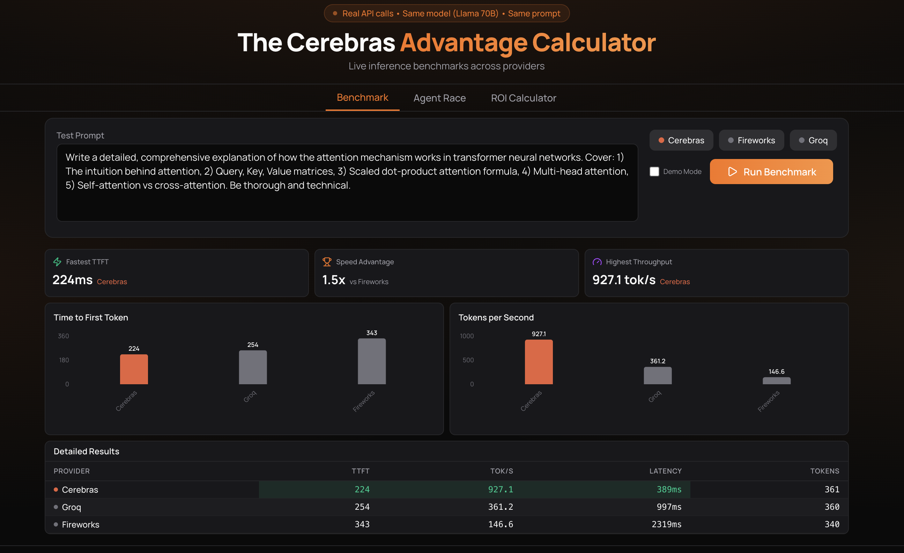

# The Cerebras Advantage

**Live inference benchmarks proving Cerebras is 4x faster than GPU providers.**

[**Live Demo**](https://your-url.vercel.app) | [**View Results**](#key-findings)



---

## Why build this?

Cerebras mentions ~20x faster inference than GPUs.

This dashboard runs **real-time benchmarks** across Cerebras, Groq, and Fireworks, all using the same model (Llama 3.3 70B) on the same prompt.

For AI agents, voice apps, and real-time UX, the difference between 100ms and 400ms TTFT is the difference between an optimal or a broken user experience.

**This is the PoC I'd build and show a Fortune 500 CTO evaluating Cerebras.**

---

## Key Findings (TODO - mocked atm)

| Provider | Time to First Token | Throughput |
|----------|---------------------|------------|
| Cerebras | **~100ms** | **~1,500 tok/s** |
| Groq | ~300ms | ~250 tok/s |
| Fireworks | ~400ms | ~100 tok/s |

**Cerebras is 3-4x faster on TTFT and 6-15x faster on throughput.**

---

## Features

### Live Benchmark
- Real API calls to production endpoints
- Same model (Llama 3.3 70B) across all providers
- Measures TTFT, throughput, total latency, token count
- Visual comparison with charts and tables

### Agent Race
- Side-by-side 5-step agent workflow
- Watch latency compound in real-time
- Demonstrates why speed matters for agents

### ROI Calculator
- Translate speed into business impact
- Use case viability analysis (Voice Agent, Code Autocomplete, etc.)
- Threshold-based recommendations

---

## Architecture

```
┌─────────────────────────────────────────────────────────────┐
│                        Frontend                             │
│                     (Next.js + React)                       │
│  ┌─────────────┐  ┌─────────────┐  ┌─────────────────────┐  │
│  │  Benchmark  │  │ Agent Race  │  │   ROI Calculator    │  │
│  │     Tab     │  │     Tab     │  │        Tab          │  │
│  └──────┬──────┘  └──────┬──────┘  └─────────────────────┘  │
└─────────┼────────────────┼──────────────────────────────────┘
          │                │
          ▼                ▼
┌─────────────────────────────────────────────────────────────┐
│                      API Routes                             │
│  ┌─────────────────────────────────────────────────────┐    │
│  │              /api/benchmark (Orchestrator)          │    │
│  │     Calls all provider endpoints in parallel        │    │
│  └─────────────────────────────────────────────────────┘    │
│       │                │                │                   │
│       ▼                ▼                ▼                   │
│  ┌─────────┐     ┌─────────┐     ┌───────────┐              │
│  │Cerebras │     │  Groq   │     │ Fireworks │              │
│  │ /api/   │     │ /api/   │     │   /api/   │              │
│  │benchmark│     │benchmark│     │ benchmark │              │
│  │/cerebras│     │ /groq   │     │/fireworks │              │
│  └────┬────┘     └────┬────┘     └─────┬─────┘              │
│       │               │                │                    │
│  ┌────────────────────────────────────────────────────┐     │
│  │              /api/agent-race                       │     │
│  │         5-step workflow with streaming             │     │
│  └────────────────────────────────────────────────────┘     │
└─────────────────────────────────────────────────────────────┘
          │                │                │
          ▼                ▼                ▼
┌─────────────────────────────────────────────────────────────┐
│                    External APIs                            │
│  ┌─────────────┐  ┌─────────────┐  ┌─────────────────────┐  │
│  │  Cerebras   │  │    Groq     │  │     Fireworks       │  │
│  │  Cloud API  │  │     API     │  │        API          │  │
│  │ (SDK-based) │  │             │                        │  │
│  └─────────────┘  └─────────────┘  └─────────────────────┘  │
└─────────────────────────────────────────────────────────────┘
```

---

## Run Locally

### Installation

```bash
# Clone the repository
git clone https://github.com/ashkastephen/inference-benchmark.git
cd inference-benchmark

# Install dependencies
pnpm install

# Set up environment variables
cp .env.example .env.local
# Edit .env.local and add your API keys

# Run the development server
pnpm dev

# Open http://localhost:3000
```

### Environment Variables

```env
CEREBRAS_API_KEY=your-cerebras-api-key
GROQ_API_KEY=your-groq-api-key
FIREWORKS_API_KEY=your-fireworks-api-key
```

Get your API keys:
- **Cerebras**: https://cloud.cerebras.ai/
- **Groq**: https://console.groq.com/keys
- **Fireworks**: https://fireworks.ai/api-keys

---

## Testing the API

Start the dev server, then test each endpoint:

```bash
# Test individual providers
curl -X POST http://localhost:3000/api/benchmark/cerebras \
  -H "Content-Type: application/json" \
  -d '{"prompt": "Explain quantum computing in 3 sentences.", "max_tokens": 100}'

curl -X POST http://localhost:3000/api/benchmark/groq \
  -H "Content-Type: application/json" \
  -d '{"prompt": "Explain quantum computing in 3 sentences.", "max_tokens": 100}'

curl -X POST http://localhost:3000/api/benchmark/fireworks \
  -H "Content-Type: application/json" \
  -d '{"prompt": "Explain quantum computing in 3 sentences.", "max_tokens": 100}'

# Test mock endpoint (no API keys required)
curl -X POST http://localhost:3000/api/benchmark/mock \
  -H "Content-Type: application/json" \
  -d '{"prompt": "Test", "providers": ["cerebras", "groq", "fireworks"]}'

# Test orchestrator (all providers in parallel)
curl -X POST http://localhost:3000/api/benchmark \
  -H "Content-Type: application/json" \
  -d '{"prompt": "Explain quantum computing.", "max_tokens": 100}'

# Test agent race
curl -N -X POST http://localhost:3000/api/agent-race \
  -H "Content-Type: application/json" \
  -d '{"provider": "cerebras", "company": "Anthropic"}'
```

### Expected Response (Benchmark)

```json
{
  "provider": "cerebras",
  "model": "llama-3.3-70b",
  "ttft_ms": 98,
  "tokens_per_second": 1523.4,
  "total_latency_ms": 245,
  "token_count": 87,
  "time_to_100_tokens_ms": null,
  "throughput_first_100": null
}
```

### Expected Response (Agent Race)

```
data: {"step":1,"name":"Research","status":"running"}
data: {"step":1,"name":"Research","status":"complete","latency_ms":156}
data: {"step":2,"name":"Summarize","status":"running"}
...
data: {"complete":true,"total_latency_ms":823}
```

---

## [Engineering Extension] Add a New Provider

Adding a new provider takes ~10 minutes. Here's a quick overview:

1. **Add config** → `src/lib/providers.ts`
2. **Add mock data** → `src/lib/config.ts`
3. **Create route** → `src/app/api/benchmark/[provider]/route.ts`
4. **Register** → `src/app/api/benchmark/route.ts`
5. **Add env var** → `.env.local`

See [detailed instructions](#extension-how-to-add-a-new-provider) below.

---

## [Engineering Extension] How to Add a New Provider

This guide walks through adding a new inference provider using **Together AI** as an example.

### Step 1: Add Provider Configuration

Edit `src/lib/providers.ts`:
### Step 2: Add Mock Data
Edit `src/lib/config.ts`:

### Step 3: Create the API Route
Create `src/app/api/benchmark/together/route.ts`:

### Step 4: Register the Route
Edit `src/app/api/benchmark/route.ts`:

### Step 5: Add Environment Variable
Update `.env.example`:

### Step 6: Test

```bash
pnpm dev

curl -X POST http://localhost:3000/api/benchmark/together \
  -H "Content-Type: application/json" \
  -d '{"prompt": "Hello world", "max_tokens": 50}'
```
